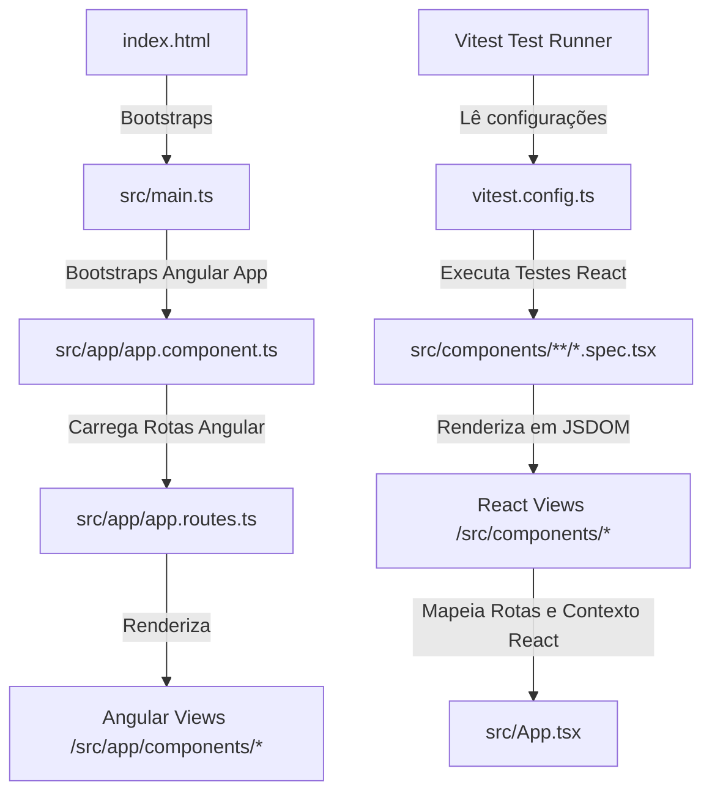

# 🏗️ Arquitetura e Estrutura do Projeto

O **FrontGestaoAtivosCart** utiliza uma arquitetura híbrida projetada para acomodar requisitos corporativos e facilitar testes automatizados. Esta seção detalha como as duas pilhas de tecnologias se organizam, a estrutura da árvore mercadológica do inventário e a estrutura de pastas do projeto.

---

## 🛠️ Arquitetura Híbrida: Angular e React

O repositório abriga em paralelo arquivos de desenvolvimento em Angular e em React:



### 1. Angular (Framework de Produção)
* **Bootstrap:** O arquivo de inicialização real do navegador (`src/main.ts`) executa o bootstrap do Angular, carregando o módulo principal `app.component.ts` com base na configuração do `app.config.ts`.
* **Rotas de Produção:** O roteamento principal executado no navegador é gerenciado por `src/app/app.routes.ts`, direcionando o usuário para os componentes nativos de Angular localizados em `src/app/components/*`.
* **Gerenciamento de Estado de Produção:** Utiliza Signals nativos do Angular dentro do serviço `src/app/store/AppStoreService.ts`.

### 2. React (Ambiente de Testes Unitários e Vitest)
* **Finalidade:** Criado para facilitar a validação lógica e de renderização de componentes com a suíte de testes rápidos do **Vitest** + **Testing Library React**.
* **Bootstrap e Rotas:** O arquivo `src/App.tsx` define a árvore de rotas correspondente para o React (com React Router Dom) e o provedor de contexto.
* **Componentes React:** Localizados em `src/components/*` (como `Dashboard.tsx`, `TreePage.tsx`, `AuditFlow.tsx` e `Login.tsx`).
* **Testes:** Os arquivos `.spec.tsx` testam esses componentes de forma ágil sob o ambiente JSDOM.

---

## 🌳 Árvore Mercadológica (Hierarquia de Inventário)

O controle de estoque e localização de ativos/cartões é baseado em uma hierarquia de **5 níveis**, mapeada recursivamente no componente `TreePage.tsx`:

1. **Nível 1: Departamento** (ex: *Tecnologia*, *Recursos Humanos*)
2. **Nível 2: Categoria** (ex: *Hardware*, *Cartões de Benefícios*)
3. **Nível 3: Tipo (Subcategoria)** (ex: *Notebooks*, *Vale Alimentação*)
4. **Nível 4: Linha** (ex: *Ultraportáteis*, *Refeição/Alimentação*)
5. **Nível 5: Marca** (ex: *Dell*, *Sodexo*)

Abaixo do Nível 5 (**Marca**), vinculam-se os **Produtos** cadastrados (ex: *Dell Latitude 3420* ou *Cartão Sodexo Refeição*).
Cada **Produto** pode possuir diversos itens físicos no estoque, classificados como:
* **Ativos:** Itens patrimoniados individuais (ex: número de patrimônio PAT-1020).
* **Lotes:** Itens consumíveis com quantidade acumulada (ex: lote com 150 cartões).

---

## 📂 Estrutura de Diretórios

A organização de pastas do repositório reflete as duas frentes de tecnologia:

```text
raiz/
├── .angular/                  # Cache e metadados de compilação do Angular
├── public/                    # Assets públicos de distribuição (imagens, ícones)
├── src/                       # Código-fonte principal
│   ├── app/                   # CONTAINER PRINCIPAL ANGULAR
│   │   ├── components/        # Componentes e views nativos do Angular (.ts)
│   │   │   └── ui/            # Elementos de UI base (Ex: skeleton)
│   │   ├── guards/            # Guards de rota para proteção de acessos (auth.guard.ts)
│   │   ├── interfaces/        # Modelos TypeScript e tipos do Supabase (user.model.ts)
│   │   ├── services/          # Conexões de API Supabase e regras de negócios
│   │   │   └── supabase.service.ts
│   │   ├── store/             # AppStoreService (Angular Signals)
│   │   ├── app.component.ts   # Componente raiz do Angular
│   │   ├── app.config.ts      # Configurações globais do Angular
│   │   └── app.routes.ts      # Rotas principais da aplicação compilada
│   │
│   ├── components/            # COMPONENTES E VIEWS EQUIVALENTES EM REACT (.tsx)
│   │   ├── ui/                # Skeletons e componentes utilitários React
│   │   ├── Login.tsx          # View de Login
│   │   ├── Dashboard.tsx      # Painel administrativo geral
│   │   ├── TreePage.tsx       # Árvore mercadológica interativa
│   │   ├── AuditFlow.tsx      # Checklist de Auditoria e assinatura
│   │   └── ...                # Demais componentes React e arquivos de teste (.spec.tsx)
│   │
│   ├── lib/                   # Configurações de conexão e types brutos do Supabase
│   ├── environments/          # Configurações de ambiente (produção/desenvolvimento)
│   ├── index.html             # Arquivo HTML base (contém a tag <app-root>)
│   ├── main.ts                # Inicializador de bootstrap da aplicação
│   ├── setupTests.ts          # Arquivo de setup de testes para o Vitest
│   └── styles.css             # Folha de estilos CSS global (Estilo Premium Dark)
│
├── angular.json               # Configurações de build do Angular CLI
├── package.json               # Scripts, dependências e configurações de pacotes
├── tsconfig.json              # Configurações gerais do TypeScript
├── vitest.config.ts           # Configurações de execução de testes do Vitest
└── README.md                  # Landing page da documentação
```

---

[⬅ Introdução e Regras](introducao.md) | [Ir para Integração com Supabase ➔](supabase.md)
