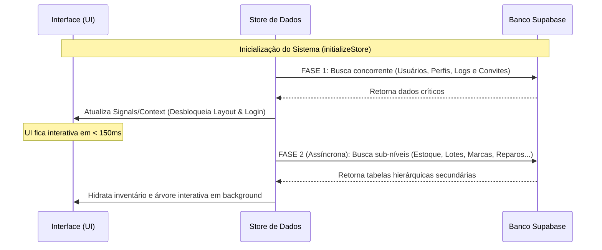

# 💾 Gerenciamento de Estado e Sincronização

O gerenciamento de dados do sistema foi estruturado em duas implementações de store com comportamento paralelo, mas adaptadas a cada ecossistema tecnológico:

---

## 🆚 Comparativo de Stores: React vs. Angular

| Característica | React (`AppStore.tsx`) | Angular (`AppStoreService.ts`) |
| :--- | :--- | :--- |
| **Mecanismo** | `createContext` + `useContext` | `@Injectable({ providedIn: 'root' })` |
| **Reatividade**| Hooks (`useState`, `useMemo`, `useEffect`) | `signal` e `computed` do Angular |
| **Compatibilidade**| Utilizado na suíte de testes unitários rápidos do Vitest | Utilizado na aplicação em produção executada no browser |
| **Métodos e Ações**| Idênticos (`initializeStore`, `addInventoryItem`, `submitAudit`, `inviteUser`, etc.) | Idênticos |

---

## ⚡ Estratégia de Hidratação de Dados em 2 Fases

Para otimizar o tempo de carregamento da interface e evitar atrasos na percepção de desempenho do usuário, o sistema implementa um fluxo de **Hidratação em 2 Fases** ao carregar os dados do banco:



### 1. Fase 1: Hidratação Crítica (Bloqueante para o Loader)
* **Objetivo:** Liberar o acesso do usuário à aplicação e verificar a sessão.
* **Dados buscados:** `usuarios`, `perfil_acesso`, `acesso_logs` e `convites`.
* **Comportamento:** Executado via `Promise.all` em paralelo. Assim que concluído, desliga a flag global `loading` e renderiza as telas principais (Login/Dashboard), liberando a interação do usuário.

### 2. Fase 2: Hidratação de Sub-níveis (Assíncrona em Background)
* **Objetivo:** Carregar os dados densos do estoque e catalogação mercadológica.
* **Dados buscados:** `tipo`, `linha`, `marca`, `produto`, `estoque` (ativos), `saldo_estoque` (lotes), `movimento_estoque`, `equipes`, `reparo`, `fornecedor`, `imagem_produto`, `usuarios_equipes` e `item_history`.
* **Comportamento:** O disparo da promessa ocorre imediatamente após a Fase 1, porém sem bloquear a renderização inicial da UI. A resposta atualiza o estado de forma reativa e populando a árvore de navegação mercadológica e tabelas internas de forma assíncrona.

---

## 🧮 Algoritmo Bottom-Up de Contagem de Itens

A árvore mercadológica exibe contadores em tempo real para indicar quantos ativos ou cartões existem dentro de cada nível hierárquico (ex: ver a contagem de itens de um Departamento inteiro). 

Para calcular essa contagem sem realizar queries pesadas de agrupamento no banco, o front-end executa uma rotina computacional em memória do tipo **Bottom-Up (de baixo para cima)** baseada em programação dinâmica e memoização (`useMemo`):

```text
Ativos Individuais (estoque) + Quantidade de Consumíveis (saldo_estoque)
                       ⬇
        1. Soma por Produto (ID único)
                       ⬇
        2. Soma por Marca (Nível 5)
                       ⬇
        3. Soma por Linha (Nível 4)
                       ⬇
        4. Soma por Tipo (Nível 3)
                       ⬇
        5. Soma por Categoria (Nível 2)
                       ⬇
        6. Soma por Departamento (Nível 1)
```

### Funcionamento do Código:
1. **Passo 1:** Agrupa as contagens por `produto_id` somando o total de ocorrências em `estoque` (ativos) mais o campo `quantidade` de `saldo_estoque` (lotes).
2. **Passo 2 (Marca):** Filtra todos os produtos da marca $M$ e soma suas quantidades.
3. **Passo 3 (Linha):** Filtra as marcas da linha $L$ e soma as contagens pré-calculadas no Passo 2.
4. **Passo 4 (Tipo):** Filtra as linhas do tipo $T$ e soma as contagens pré-calculadas no Passo 3.
5. **Passo 5 (Categoria):** Filtra os tipos da categoria $C$ e soma as contagens pré-calculadas no Passo 4.
6. **Passo 6 (Departamento):** Filtra as categorias do departamento $D$ e soma as contagens pré-calculadas no Passo 5.

Essa abordagem garante que uma atualização em qualquer item individual (ex: dar baixa em um ativo ou transferir um item) seja propagada instantaneamente para todos os nós superiores da hierarquia visual na tela com custo computacional mínimo.

---

[⬅ Integração com Supabase](supabase.md) | [Ir para Componentes e Telas ➔](componentes.md)
