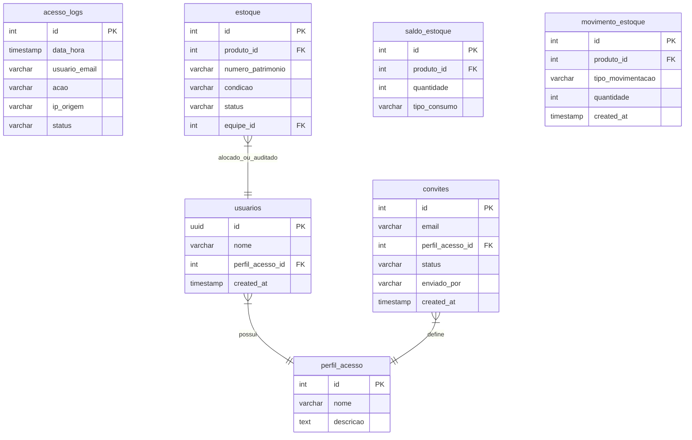

# ☁️ Integração com Supabase e RLS

O **FrontGestaoAtivosCart** utiliza o **Supabase** como plataforma backend-as-a-service. A integração é feita através da biblioteca cliente oficial `@supabase/supabase-js`, que gerencia autenticação, consultas a banco de dados relacional (PostgreSQL), upload de imagens no Storage e chamadas de Edge Functions.

---

## 📊 Modelo de Dados e Tabelas Públicas

O sistema consome tabelas organizadas para controle relacional estrito. Abaixo está o mapeamento das principais tabelas expostas em `src/app/interfaces/database.types.ts` e `src/lib/supabase/types.ts`:



### Detalhes das Tabelas:
* **`usuarios`:** Perfis de usuários locais. A chave primária `id` é vinculada diretamente à tabela de autenticação interna do Supabase (`auth.users`).
* **`perfil_acesso`:** Perfis de segurança que definem os cargos organizacionais (`Gestor`, `Gerente`, `Supervisor`, `Membro Comum`).
* **`acesso_logs`:** Tabela de auditoria de segurança que grava ações como logins, tentativas fracassadas, submissões de relatórios físicos, exclusão de usuários e envio de convites.
* **`convites`:** Registro de convites de e-mail disparados para novos colaboradores, com rastreabilidade de quem convidou e o status (`Pendente`/`Aceito`).
* **`estoque`:** Armazena os ativos físicos patrimoniados (equipamentos individuais).
* **`saldo_estoque`:** Armazena os saldos volumétricos para itens consumíveis (lotes).
* **`movimento_estoque`:** Registro histórico de todas as transações de entrada, saída, perdas e transferências de estoque para auditoria retroativa.

---

## 🔑 Serviço de Autenticação (`AuthService.ts`)

O serviço `AuthService.ts` gerencia todo o ciclo de vida da sessão do usuário. Seus métodos principais incluem:

* **`signIn(email, password)`:** Realiza autenticação com e-mail/senha.
* **`signOut()`:** Encerra a sessão ativa no navegador.
* **`resetPassword(email)`:** Envia link de redefinição de senha, redirecionando o usuário para `/update-password`.
* **`resendConfirmationEmail(email)`:** Reenvia link de confirmação para contas pendentes de ativação.
* **`updatePassword(password)`:** Altera a senha do usuário atualmente autenticado.
* **`getCurrentUser()`:** Busca o usuário da sessão ativa e faz um `join` relacional na tabela `usuarios` com o perfil `perfil_acesso` para resolver o cargo textual do colaborador (ex: `Gestor`). Caso a conta pública do usuário não exista, o método resolve um perfil fallback de `Membro Comum` para evitar interrupções no front-end.

---

## 🧩 Injeção de Dependência Flexível (Angular vs. React)

Como o projeto possui uma infraestrutura híbrida, o `AuthService` foi arquitetado com uma técnica flexível de injeção de dependência na inicialização do cliente Supabase para funcionar sem quebras tanto no runtime do Angular quanto nos testes do React:

```typescript
// AuthService.ts
private supabase = (() => {
  try {
    // Tenta injetar o serviço no padrão do Angular
    return inject(SupabaseService);
  } catch {
    // Se falhar (fora do contexto Angular, ex: nos testes de React),
    // instancia um cliente SupabaseService isolado
    return new SupabaseService();
  }
})();
```

* No **Angular**, o Angular CLI resolve a injeção automaticamente através do Service Singleton `SupabaseService`.
* No **React/Vitest**, o código intercepta a ausência do contexto de injeção Angular no bloco `catch` e cria uma instância pura em tempo de execução, garantindo que os testes rodem sem erros de bootstrap de dependência.

---

## 🔒 Políticas de RLS (Row-Level Security) e Segurança

A governança do banco é garantida na nuvem por meio de políticas de **Row-Level Security (RLS)** criadas nas tabelas do Supabase. O front-end respeita e reflete essas restrições:

### 1. Políticas Restritivas de RLS
* **Visualização:** Qualquer usuário autenticado possui política para ler as tabelas de inventário e árvore mercadológica (`SELECT`).
* **Modificação de Inventário:** Apenas requisições com tokens JWT de contas associadas ao perfil de `Gestor` (ID 1) têm permissão para disparar comandos de `INSERT` ou `DELETE` na tabela `estoque`.
* **Auditorias:** Apenas perfis de `Gestor` ou `Gerente` (Auditor) podem registrar dados na tabela `item_history` e atualizar a condição do ativo em `estoque` (`UPDATE`).

### 2. Edge Function `invite-user`
Para disparar convites de novos colaboradores de forma segura sem expor chaves administrativas do Supabase no front-end, o sistema consome uma Edge Function chamada `invite-user`.
* O administrador fornece o e-mail do colaborador e o papel desejado.
* A Edge Function recebe a requisição, valida se quem a chamou é de fato um `Gestor` e utiliza a API administrativa do Supabase (`auth.admin.inviteUserByEmail`) para enviar o e-mail.
* Após o sucesso da chamada, a interface atualiza e registra o convite na tabela pública.

---

[⬅ Arquitetura e Estrutura](arquitetura.md) | [Ir para Gerenciamento de Estado ➔](gerenciamento_estado.md)
